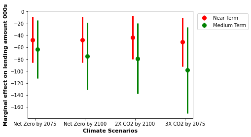

### Abstract

The agricultural sector is particularly susceptible to the impact of climate
change, both in terms of production and access to bank financing. This paper
contributes to the literature by investigating how vulnerability to climate change
affects U.S. farms’ credit access, using a novel panel dataset at county level and
at bank level. The results show that increasing exposure to climate change can
reduce bank lending to farms, and such impact is nonlinear. Additionally, while
the contemporaneous effects are significant, the impact of climate change on bank
lending also materializes over time. While the overall effects are negative, more
granular analysis suggests that different farm groups fare differently. With growing
vulnerability to climate change, small to medium farms almost always experience
some loss of loan access and funding. In comparison, large farms see less severe
credit contraction, and in some cases may even see improvement in funding. While
such patterns hold for the United States as a whole, there is heterogeneity of impact
depending on farm regions, income areas, and the types of banks providing the
lending.
### Access

The link to this paper is [here](https://www.dropbox.com/s/simioylaaxbxozi/climate_farm_bank.pdf?dl=0)
### Presentations
- UC Santa Cruz Postdoc Symposium, Santa Cruz, May 2022
- Office of the Comptroller of the Currency (OCC) Symposium on Climate Risk in Banking and Finance, Washington DC, June 2022
- Graduate Climate Conference (poster), Seattle, October 2022

### Grants
- Hammett Fellowship on Climate Change
- Food System Research Fund

