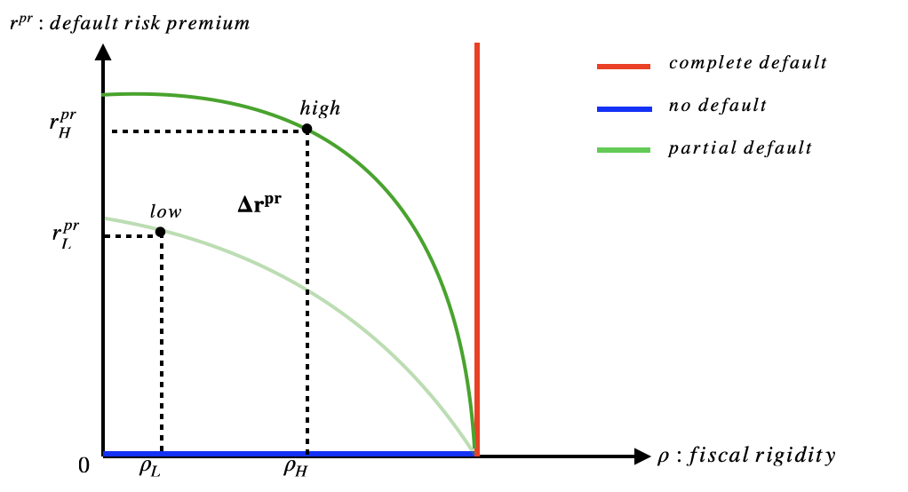

#### Abstract

 Responding to climate change poses increasingly high fiscal costs. In this paper I examine how climate change affects sovereign default risks and fiscal policy through a set of empirical results and a stylized model. Using panel data of 135 countries over 1995-2018, I first show that 1 percentage increase of vulnerability to climate risks can increase sovereign default probability by around 5 percentage points, and such default risks may differ by fiscal conditions. More specifically, fiscal conditions refer to whether and how a government can conduct tax and expenditure adjustment to respond to aggregate shocks. The stylized model of sovereign default also shows that the physical risks of climate change raise default probability. Moreover, if a government has high fiscal rigidity, it also raises the default probability, thus potentially amplifying the costs of climate risks. Such results point to the importance of structural reform to reduce a government's debt vulnerability resulting from climate change.

#### Access

- Link to slide deck is [here](https://www.dropbox.com/s/5uogd98oxhlgpev/Liu_presentation-2022.pdf?dl=0)
- Link to paper forthcoming
